# Sonic API - Comprehensive Music Industry Management Platform

## Overview

Sonic API is a comprehensive RESTful web API built with .NET 9.0 that provides complete music industry management capabilities. The platform offers robust entity management, resource permissions, financial tracking, and external service integrations for artists, venues, events, tours, and more.

## 🎯 Core Capabilities

- **Artist Management**: Complete artist profiles, member management, and collaboration tools
- **Event Scheduling**: Comprehensive event planning, lineup management, and attendee tracking
- **Venue Management**: Location management, capacity tracking, and facility coordination
- **Tour Organization**: Multi-city tour planning, show coordination, and logistics management
- **Song Catalog**: Music library with Spotify integration and metadata management
- **Instrument Tracking**: Equipment management, ownership tracking, and maintenance records
- **Budget & Expense Management**: Financial planning, expense tracking, and approval workflows
- **User Authentication**: JWT-based auth with Google OAuth integration and role-based permissions

## 🏗️ System Architecture

### Technology Stack
- **.NET 9.0**: Latest .NET framework with performance optimizations
- **Entity Framework Core**: ORM with PostgreSQL database provider
- **PostgreSQL**: Robust relational database with JSON support
- **JWT Authentication**: Secure token-based authentication
- **Mapster**: High-performance object mapping
- **Generic Entity Framework**: Unified CRUD operations across all entities

### Architectural Patterns
- **Generic Entity Service**: Unified service layer for all entities with automatic CRUD, pagination, search, and relationship includes
- **Cascading Ownership**: Automatic permission inheritance using `[CascadeOwnershipFrom]` attributes
- **Resource Membership System**: Granular permissions (Viewer, Member, Organizer, Manager, Owner, Administrator)
- **Summary DTO Pattern**: Prevents circular references while maintaining full navigation capabilities

## 📊 Entity Systems

### [Artist Management System](ARTIST_SYSTEM_GUIDE.md)
Complete artist profile management with member collaboration, external integrations, and cascading ownership.

**Key Features:**
- Artist profiles with comprehensive metadata
- Member management and collaboration tools
- External service integrations (Spotify, social media)
- Cascading ownership to related entities
- Performance and song repertoire tracking

### [Event Management System](EVENT_SYSTEM_GUIDE.md)
Comprehensive event scheduling, lineup management, venue integration, and attendee tracking.

**Key Features:**
- Event scheduling and planning
- Artist lineup management
- Venue integration and capacity management
- Tour association and coordination
- Attendee tracking and management

### [Venue Management System](VENUE_SYSTEM_GUIDE.md)
Physical location management with capacity tracking, mapping integration, and event hosting capabilities.

**Key Features:**
- Complete venue profiles with address and contact information
- Capacity management and event planning constraints
- Google Maps integration for location services
- Event hosting and relationship management
- Budget ownership for facility management

### [User Management System](USER_SYSTEM_GUIDE.md)
Comprehensive user authentication, authorization, and profile management with external integrations.

**Key Features:**
- JWT-based authentication with refresh tokens
- Google OAuth integration
- Role-based permissions (Administrator, Member, User)
- Resource membership management
- Profile management with external service links

### [Song Management System](SONG_SYSTEM_GUIDE.md)
Musical composition management with Spotify integration, artist associations, and performance tracking.

**Key Features:**
- Song metadata with ISRC codes and technical details
- Spotify integration for music discovery and metadata
- Artist associations and repertoire management
- Performance tracking across events and tours
- Lyrics and credit management

### [Instrument Management System](INSTRUMENT_SYSTEM_GUIDE.md)
Musical instrument cataloging with ownership tracking, technical specifications, and performance usage.

**Key Features:**
- Comprehensive instrument specifications and metadata
- Ownership and borrowing relationship management
- Condition tracking and value management
- Performance usage tracking
- Maintenance records and service history

### [Tour Management System](TOUR_SYSTEM_GUIDE.md)
Multi-city tour planning with show coordination, artist management, and logistics tracking.

**Key Features:**
- Tour planning and route optimization
- Show scheduling and venue coordination
- Artist lineup management across tour dates
- Financial planning and expense tracking
- Logistics and travel coordination

### [Budget & Expense Management System](BUDGET_SYSTEM_GUIDE.md)
Comprehensive financial management with cascading ownership, approval workflows, and expense tracking.

**Key Features:**
- Budget creation with Artist/Venue ownership constraints
- Expense tracking with approval workflow (Pending → Approved/Void → Paid/Void)
- Cascading ownership from Artists and Venues
- Optional Tour/Event associations for detailed tracking
- Complete financial reporting and analytics

## 🔐 Permission System

### System Roles
- **Administrator**: Full system access and user management
- **Member**: Standard user with full feature access
- **User**: Basic user with limited access

### Resource Permissions
Fine-grained permissions on individual resources:
- **Owner**: Full control over the resource
- **Manager**: Management and modification permissions
- **Member**: Standard access and collaboration permissions
- **Viewer**: Read-only access

### Cascading Ownership
Automatic permission inheritance using attributes:
```csharp
[CascadeOwnershipFrom(nameof(Artist))]
public class Budget : GenericEntity
{
    public int? ArtistId { get; set; }
    public virtual Artist? Artist { get; set; }
}
```

## 🗄️ Database Architecture

### Entity Relationship Diagram

```mermaid
erDiagram
    Users ||--o{ Artists : "owns/manages"
    Users ||--o{ Events : "creates/manages"
    Users ||--o{ ResourceMemberships : "has"
    
    Artists ||--o{ Events : "performs_at"
    Artists ||--o{ Songs : "performs"
    Artists ||--o{ Instruments : "owns/uses"
    Artists ||--o{ Tours : "participates_in"
    Artists ||--o{ Budgets : "owns"
    Artists ||--o{ Expenses : "creates"
    Artists ||--o{ ResourceMemberships : "grants_access"
    
    Venues ||--o{ Events : "hosts"
    Venues ||--o{ Budgets : "owns"
    Venues ||--o{ Expenses : "creates"
    Venues ||--o{ ResourceMemberships : "grants_access"
    
    Tours ||--o{ Events : "includes"
    Tours ||--o{ Budgets : "owns"
    Tours ||--o{ Expenses : "creates"
    Tours ||--o{ ResourceMemberships : "grants_access"
    
    Events ||--o{ EventArtists : "features"
    Events ||--o{ Budgets : "owns"
    Events ||--o{ Expenses : "creates"
    Events ||--o{ ResourceMemberships : "grants_access"
    Events }o--|| Venues : "held_at"
    Events }o--o| Tours : "part_of"
    
    Songs ||--o{ EventArtists : "performed_in"
    Songs ||--o{ ResourceMemberships : "grants_access"
    
    Instruments ||--o{ EventArtists : "used_in"
    Instruments ||--o{ ResourceMemberships : "grants_access"
    
    Budgets ||--o{ Expenses : "tracks"
    Budgets }o--o| Artists : "owned_by"
    Budgets }o--o| Venues : "owned_by"
    Budgets }o--o| Tours : "associated_with"
    Budgets }o--o| Events : "associated_with"
    
    Expenses }o--|| Budgets : "charged_to"
    Expenses }o--o| Artists : "owned_by"
    Expenses }o--o| Venues : "owned_by"
    Expenses }o--o| Tours : "associated_with"
    Expenses }o--o| Events : "associated_with"
    
    ResourceMemberships }o--|| Users : "belongs_to"
    
    Users {
        int Id PK
        uuid Uuid UK
        string Username UK
        string Email UK
        string PasswordHash
        string FirstName
        string LastName
        string DisplayName
        string Bio
        string ProfilePicture
        date DateOfBirth
        string Location
        string Website
        enum Role
        boolean EmailVerified
        string GoogleId UK
        jsonb ExternalSources
        timestamp CreatedAt
        timestamp UpdatedAt
        string Emoji
    }
    
    Artists {
        int Id PK
        uuid Uuid UK
        string Name
        string Bio
        string Genre
        string FormationLocation
        date FormationDate
        jsonb ExternalSources
        jsonb Contacts
        timestamp CreatedAt
        timestamp UpdatedAt
        string Emoji
    }
    
    Venues {
        int Id PK
        uuid Uuid UK
        string Name
        string Description
        int Capacity
        string Phone
        string Website
        string Email
        jsonb Address
        jsonb ExternalSources
        jsonb Contacts
        timestamp CreatedAt
        timestamp UpdatedAt
        string Emoji
    }
    
    Events {
        int Id PK
        uuid Uuid UK
        string Name
        string Description
        timestamp EventDate
        string Status
        int MaxAttendees
        decimal TicketPrice
        string TicketUrl
        jsonb ExternalSources
        jsonb Contacts
        int VenueId FK
        int TourId FK
        timestamp CreatedAt
        timestamp UpdatedAt
        string Emoji
    }
    
    Tours {
        int Id PK
        uuid Uuid UK
        string Name
        string Description
        date StartDate
        date EndDate
        string Status
        string TourManager
        jsonb ExternalSources
        jsonb Contacts
        timestamp CreatedAt
        timestamp UpdatedAt
        string Emoji
    }
    
    Songs {
        int Id PK
        uuid Uuid UK
        string Title
        string Genre
        interval Duration
        date ReleaseDate
        string Album
        int TrackNumber
        string ISRC
        string Description
        text Lyrics
        jsonb ExternalSources
        jsonb Credits
        timestamp CreatedAt
        timestamp UpdatedAt
        string Emoji
    }
    
    Instruments {
        int Id PK
        uuid Uuid UK
        string Name
        string Type
        string Brand
        string Model
        int Year
        string SerialNumber
        string Description
        string Condition
        decimal Value
        jsonb Specifications
        jsonb ExternalSources
        text MaintenanceNotes
        timestamp CreatedAt
        timestamp UpdatedAt
        string Emoji
    }
    
    Budgets {
        int Id PK
        uuid Uuid UK
        string Name
        string Category
        decimal TotalAmount
        decimal SpentAmount
        string Status
        date StartDate
        date EndDate
        string Description
        int ArtistId FK
        int VenueId FK
        int TourId FK
        int EventId FK
        timestamp CreatedAt
        timestamp UpdatedAt
        string Emoji
    }
    
    Expenses {
        int Id PK
        uuid Uuid UK
        string Name
        string Description
        decimal Amount
        string Category
        string Status
        date ExpenseDate
        date ApprovedDate
        date PaidDate
        string ReceiptUrl
        string Notes
        int BudgetId FK
        int ArtistId FK
        int VenueId FK
        int TourId FK
        int EventId FK
        timestamp CreatedAt
        timestamp UpdatedAt
        string Emoji
    }
    
    EventArtists {
        int EventId FK
        int ArtistId FK
        string Role
        time SetTime
        int SetDuration
        string Notes
        timestamp CreatedAt
        timestamp UpdatedAt
    }
    
    ResourceMemberships {
        int Id PK
        int UserId FK
        string ResourceType
        int ResourceId
        enum Permission
        timestamp GrantedAt
        int GrantedBy FK
    }
```


### Entity Framework Core
- **PostgreSQL Provider**: Robust relational database with JSON support
- **Migrations**: Automated database schema management
- **Indexes**: Optimized queries with strategic indexing
- **Constraints**: Data integrity with database-level constraints

### Generic Entity Base
All entities inherit from `GenericEntity`:
```csharp
public abstract class GenericEntity
{
    public int Id { get; set; }
    public Guid Uuid { get; set; }
    public required string Name { get; set; }
    public DateTime CreatedAt { get; set; }
    public DateTime UpdatedAt { get; set; }
    public string? Emoji { get; set; }
}
```

### JSON Columns
Flexible data storage with PostgreSQL JSONB:
- `ExternalSources`: External service integrations
- `Contacts`: Contact information arrays
- `Specifications`: Technical specifications (instruments)
- `Credits`: Credit and attribution information

## 🚀 API Architecture

### Generic Entity Controller
Unified API endpoints for all entities:
```
GET    /api/{entity}                    # Get all with pagination
GET    /api/{entity}/{id}               # Get by ID
GET    /api/{entity}/search?q={query}   # Search entities
POST   /api/{entity}                    # Create new
PUT    /api/{entity}/{id}               # Update existing
DELETE /api/{entity}/{id}               # Delete entity
```

### Query Parameters
Consistent querying across all endpoints:
- `page` & `pageSize`: Pagination control
- `include`: Related entity inclusion
- `q`: Search query parameter
- `owner`: Filter by ownership

### Response Format
Standardized JSON responses:
```json
{
  "data": [ /* entities */ ],
  "pagination": {
    "page": 1,
    "pageSize": 10,
    "totalCount": 150,
    "totalPages": 15
  }
}
```

## 🔌 External Integrations

### Spotify Web API
Complete music discovery and metadata integration:
- **Track Search**: Find songs with metadata
- **Artist Search**: Discover artists and their catalogs
- **Album Data**: Retrieve album information and artwork
- **Streaming Links**: Direct links to Spotify content

### Google Services
Location and authentication services:
- **OAuth 2.0**: Secure authentication integration
- **Maps API**: Place search, autocomplete, and geocoding
- **Places API**: Venue details and location data

### Authentication Integration
- **JWT Tokens**: Secure API access with refresh capabilities
- **Google OAuth**: Social login integration
- **Multi-provider Support**: Extensible authentication system

## 📈 Analytics & Reporting

### Performance Metrics
- **Event Analytics**: Attendance tracking and venue utilization
- **Artist Performance**: Song performance and popularity metrics
- **Financial Reporting**: Budget vs. actual expense analysis
- **Tour Success Metrics**: Revenue, attendance, and operational efficiency

### Data Insights
- **Trending Content**: Popular songs, artists, and venues
- **Geographic Analysis**: Event distribution and regional performance
- **Financial Trends**: Spending patterns and budget optimization
- **Operational Efficiency**: Resource utilization and workflow optimization

## 🛠️ Development Workflow

### Local Development
```bash
# Clone repository
git clone [repository-url]
cd Sonic.API

# Restore dependencies
dotnet restore

# Update database
dotnet ef database update

# Run development server
dotnet run
```

### Database Migrations
```bash
# Add new migration
dotnet ef migrations add [MigrationName]

# Update database
dotnet ef database update

# Rollback migration
dotnet ef database update [PreviousMigrationName]
```

### Testing
```bash
# Run all tests
dotnet test

# Run with coverage
dotnet test --collect:"XPlat Code Coverage"
```

## 📋 Configuration

### Environment Variables
```env
# Database
ConnectionStrings__DefaultConnection=Host=localhost;Database=sonic;Username=user;Password=pass

# JWT
JWT__SecretKey=your-secret-key
JWT__Issuer=Sonic.API
JWT__Audience=Sonic.Client
JWT__ExpireMinutes=15
JWT__RefreshExpireDays=7

# Google OAuth
Google__ClientId=your-google-client-id
Google__ClientSecret=your-google-client-secret

# Spotify
Spotify__ClientId=your-spotify-client-id
Spotify__ClientSecret=your-spotify-client-secret

# Maps
Maps__GoogleApiKey=your-google-maps-api-key
```

### Application Settings
```json
{
  "Logging": {
    "LogLevel": {
      "Default": "Information",
      "Microsoft.AspNetCore": "Warning"
    }
  },
  "AllowedHosts": "*",
  "Pagination": {
    "DefaultPageSize": 10,
    "MaxPageSize": 100
  }
}
```

## 🔒 Security Features

### Authentication & Authorization
- **JWT Tokens**: Secure API access with configurable expiration
- **Refresh Tokens**: Long-lived tokens for seamless user experience
- **Role-Based Access**: System-wide permission levels
- **Resource Permissions**: Granular access control on individual entities

### Data Protection
- **Password Hashing**: bcrypt with salt for secure password storage
- **Input Validation**: Comprehensive validation and sanitization
- **SQL Injection Prevention**: Parameterized queries and Entity Framework protection
- **XSS Protection**: Input encoding and validation

### API Security
- **HTTPS Enforcement**: Secure communication protocols
- **CORS Configuration**: Controlled cross-origin resource sharing
- **Rate Limiting**: API abuse prevention
- **Request Validation**: Comprehensive input validation

## 📚 API Documentation

### Swagger Integration
Interactive API documentation available at `/swagger` endpoint:
- **Endpoint Documentation**: Complete API reference
- **Schema Definitions**: Data model documentation
- **Interactive Testing**: Built-in API testing capabilities
- **Authentication Support**: Test with actual JWT tokens

### Example Requests
Comprehensive examples for all entity operations:
- **CRUD Operations**: Create, read, update, delete examples
- **Search and Filtering**: Query parameter usage
- **Relationship Management**: Association and inclusion examples
- **Authentication Flows**: Login, refresh, and OAuth examples

## 🚀 Deployment

### Docker Support
```dockerfile
FROM mcr.microsoft.com/dotnet/aspnet:9.0 AS base
WORKDIR /app
EXPOSE 80
EXPOSE 443

FROM mcr.microsoft.com/dotnet/sdk:9.0 AS build
WORKDIR /src
COPY ["Sonic.API.csproj", "."]
RUN dotnet restore
COPY . .
RUN dotnet build -c Release -o /app/build

FROM build AS publish
RUN dotnet publish -c Release -o /app/publish

FROM base AS final
WORKDIR /app
COPY --from=publish /app/publish .
ENTRYPOINT ["dotnet", "Sonic.API.dll"]
```

### Production Considerations
- **Database Connection Pooling**: Optimize PostgreSQL connections
- **Caching Strategy**: Implement Redis for session and data caching
- **Load Balancing**: Horizontal scaling with multiple instances
- **Monitoring**: Application performance monitoring and logging
- **Backup Strategy**: Regular database backups and disaster recovery

## 🔄 Data Flow Examples

### Creating an Event with Full Context
```javascript
// 1. Create or select venue
POST /api/venues { "name": "Madison Square Garden", ... }

// 2. Create event
POST /api/events {
  "name": "Rock Concert 2024",
  "eventDate": "2024-08-15T20:00:00Z",
  "venueId": 1,
  "tourId": 1
}

// 3. Add artists to event
POST /api/events/1/artists {
  "artistId": 1,
  "role": "Headliner",
  "setTime": "21:00"
}

// 4. Create budget for event
POST /api/budgets {
  "name": "Event Production Budget",
  "totalAmount": 50000,
  "eventId": 1
}
```

### Artist Collaboration Workflow
```javascript
// 1. Create artist
POST /api/artists { "name": "The Sonic Band", ... }

// 2. Invite collaborators
POST /api/artists/1/members {
  "userId": 2,
  "role": "Member"
}

// 3. Add songs to repertoire
POST /api/artists/1/songs { "songId": 1 }

// 4. Plan tour
POST /api/tours {
  "name": "World Tour 2024",
  "artistIds": [1]
}
```

## 🤝 Contributing

### Code Standards
- **C# Coding Conventions**: Follow Microsoft C# coding standards
- **Entity Framework Patterns**: Consistent data access patterns
- **API Design**: RESTful design principles
- **Testing**: Comprehensive unit and integration tests

### Development Process
1. **Feature Branches**: Create feature branches from main
2. **Pull Requests**: Comprehensive code review process
3. **Testing**: Ensure all tests pass before merging
4. **Documentation**: Update relevant documentation

## 📖 Additional Resources

### System Guides
- [Artist Management System Guide](ARTIST_SYSTEM_GUIDE.md)
- [Event Management System Guide](EVENT_SYSTEM_GUIDE.md)
- [Venue Management System Guide](VENUE_SYSTEM_GUIDE.md)
- [User Management System Guide](USER_SYSTEM_GUIDE.md)
- [Song Management System Guide](SONG_SYSTEM_GUIDE.md)
- [Instrument Management System Guide](INSTRUMENT_SYSTEM_GUIDE.md)
- [Tour Management System Guide](TOUR_SYSTEM_GUIDE.md)
- [Budget & Expense Management System Guide](BUDGET_SYSTEM_GUIDE.md)

### External Documentation
- [.NET 9.0 Documentation](https://docs.microsoft.com/en-us/dotnet/)
- [Entity Framework Core](https://docs.microsoft.com/en-us/ef/core/)
- [PostgreSQL Documentation](https://www.postgresql.org/docs/)
- [Spotify Web API](https://developer.spotify.com/documentation/web-api/)
- [Google Maps API](https://developers.google.com/maps/documentation)

## 📝 License

This project is licensed under the MIT License - see the LICENSE file for details.

## 📞 Support

For support and questions:
- **Documentation**: Comprehensive guides for each system
- **API Reference**: Interactive Swagger documentation
- **Issue Tracking**: GitHub issues for bug reports and feature requests
- **Community**: Developer community discussions and support

---

**Sonic API** - Empowering the music industry with comprehensive management tools and seamless integrations.
